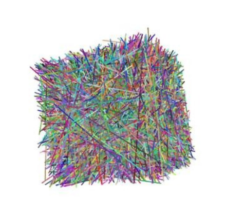
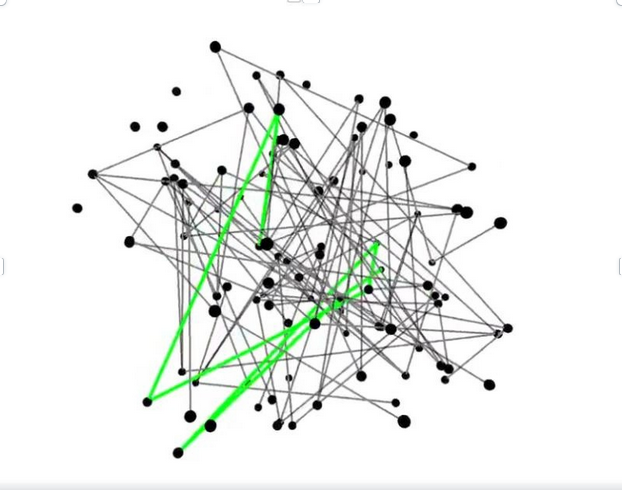
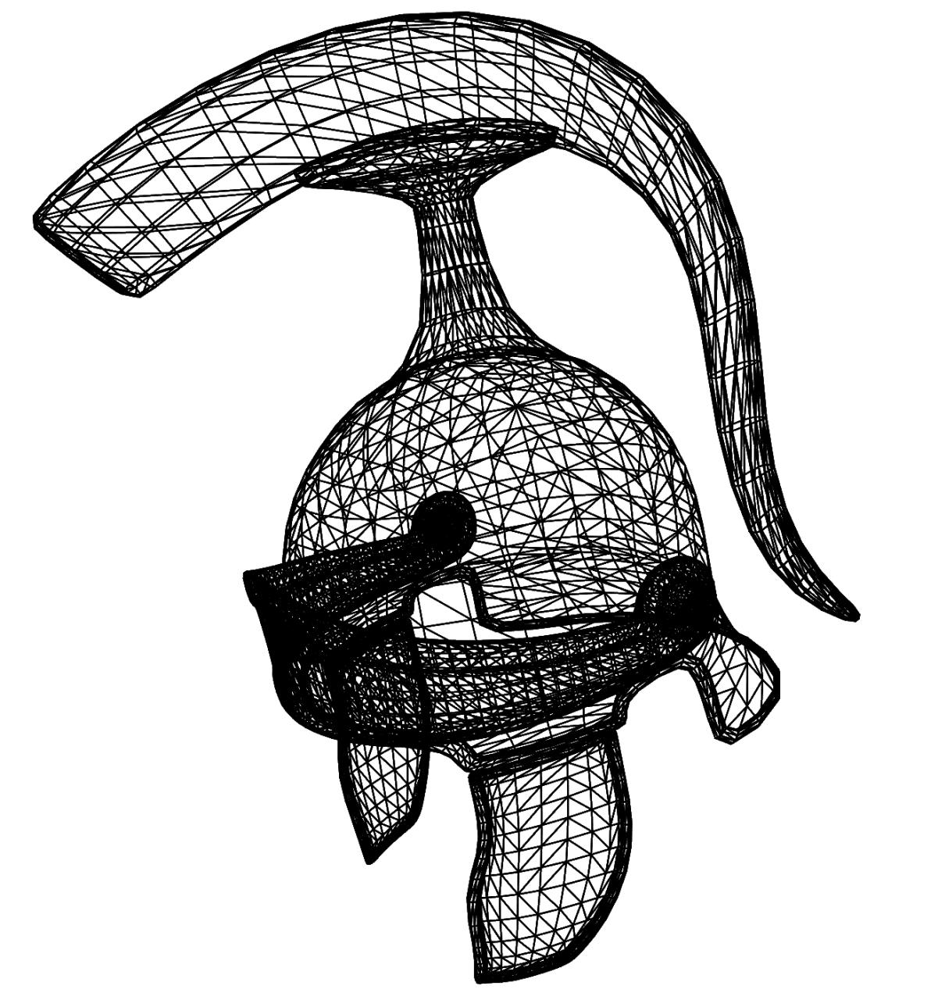
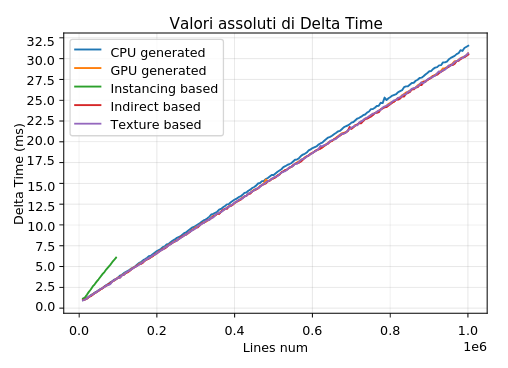
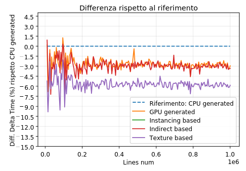
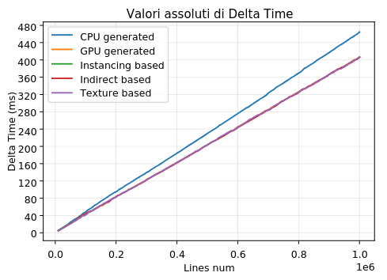
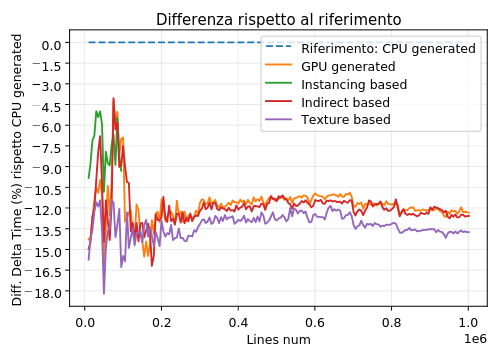

# BGFX Lines Rendering

## 1. Introduction

BGFX Lines is an **open-source**, **general-purpose**, **multi-platform** C++ library for
rendering lines and polylines with variable thickness, custom caps, joins, and
advanced visual effects—without relying on native API line primitives.
Developed as part of my Bachelor’s degree final exam, the project leverages the
bgfx cross-platform rendering library and demonstrates multiple algorithms for
efficient and high-quality line rendering.

- No API line primitives used (fully custom)
- Supports variable thickness, caps, joins, borders
- Multiple CPU/GPU implementations including instancing and compute

## 2. Papers, Libraries, and Requirements

### Papers & References

- bgfx: Cross-platform rendering library — https://github.com/bkaradzic/bgfx
- bx — https://github.com/bkaradzic/bx
- bimg (optional) — https://github.com/bkaradzic/bimg
- https://www.labri.fr/perso/nrougier/python-opengl/#rendering-lines
- https://www.yumpu.com/en/document/read/55443281/opengl-blueprint-rendering
- https://jcgt.org/published/0002/02/08/
- https://developer.nvidia.com/gpugems/gpugems2/part-iii-high-quality-rendering/chapter-22-fast-prefiltered-lines

### Requirements

- C++17 or newer
- CMake ≥ 3.15
- Supported OS: Windows, Linux, macOS (others may work)
- GPU backend supported by bgfx (OpenGL, Direct3D, Vulkan, Metal)
- Shader model and compute support required for GPU-generated paths

## 3. Features

- Variable-width lines and polylines
- Caps (butt/round/square), joins (miter/bevel/round), borders/outlines
- Anti-aliased rendering strategies
- Five rendering approaches:
  - CPU-Generated: buffers generated on CPU, classical draw
  - GPU-Generated: buffers generated via compute shaders, then drawn
  - CPU Instancing: CPU data + instanced rendering
  - GPU Instancing: GPU compute + instanced rendering
  - Texture Instancing: instance data via texture buffer (TBO/SSBO)
- General-purpose, multi-platform, bgfx-based
- Modular design for easy integration into existing engines/tools

## 4. Installation and Usage

### 4.1. Getting the Source

```bash
git clone --recursive https://github.com/youruser/bgfx-lines.git
cd bgfx-lines
```

If you forgot `--recursive`, run:

```bash
git submodule update --init --recursive
```

### 4.2. Building

```bash
cmake -B build -DCMAKE_BUILD_TYPE=Release
cmake --build build --config Release
```

Artifacts:
- Static/dynamic library target(s) for integration
- Example/demo executables (if enabled)

Optional CMake options (create as needed):
- `-DLINES_BUILD_EXAMPLES=ON`
- `-DLINES_BUILD_TESTS=ON`

### 4.3. Minimal Usage Example

```cpp
std::vector<lines::LinesVertex> points;
generatePointsInCube(points, 3, 100);
line = std::make_unique<lines::InstancingLines>(points);
line->settings().setThickness(5);
line->settings().setBorder(2);
line->settings().setAntialias(0);
line->settings().setLeftCap(lines::LineCap::TRIANGLE_CAP);
line->settings().setRigthCap(lines::LineCap::ROUND_CAP);
line->settings().setColorToUse(lines::LineColorToUse::PER_VERTEX_COLOR);
line->settings().setGeneralColor(lines::LinesVertex::COLOR(1, 0, 1, 1));


while (running) {
    // ... bgfx frame prep ...
    bgfx::touch(0);
    line->draw(0);
    bgfx::frame();
}
// Cleanup lines and bgfx...
```

See the `examples/` folder for fully working samples per backend.

## 5. Results

<div align="center">

<table>
  <tr>
    <td align="center" width="380">
      <br>
      <sub>Rendering of 500.000 lines visual effect and update each 1.0 sec</sub>
    </td>
    <td align="center" width="400">
      <br>
      <sub>Rendering of a Graph using custom lines and polylines system with visual effects</sub>
    </td>
    <td align="center" width="300">
      <br>
      <sub>Rendering of a model wireframe using custom lines with 5px thickness</sub>
    </td>
  </tr>
</table>

</div>

## 6. Benchmark and Performance Analysis
<table>
  <tr>
    <td align="center" width="350">
      <br>
      <sub>Delta Time absulute value with static buffers (no-updates)</sub>
    </td>
    <td align="center" width="350">
      <br>
      <sub>Delta Time compared with reference implementation with static buffers (no-updates)</sub>
    </td>
  </tr>
  <tr>
    <td align="center" width="350">
      <br>
      <sub>Delta Time absulute value with dynamic buffers (updates)</sub>
    </td>
    <td align="center" width="350">
      <br>
      <sub>Delta Time compared with reference implementation with dynamic buffers (updates)</sub>
    </td>
  </tr>
</table>